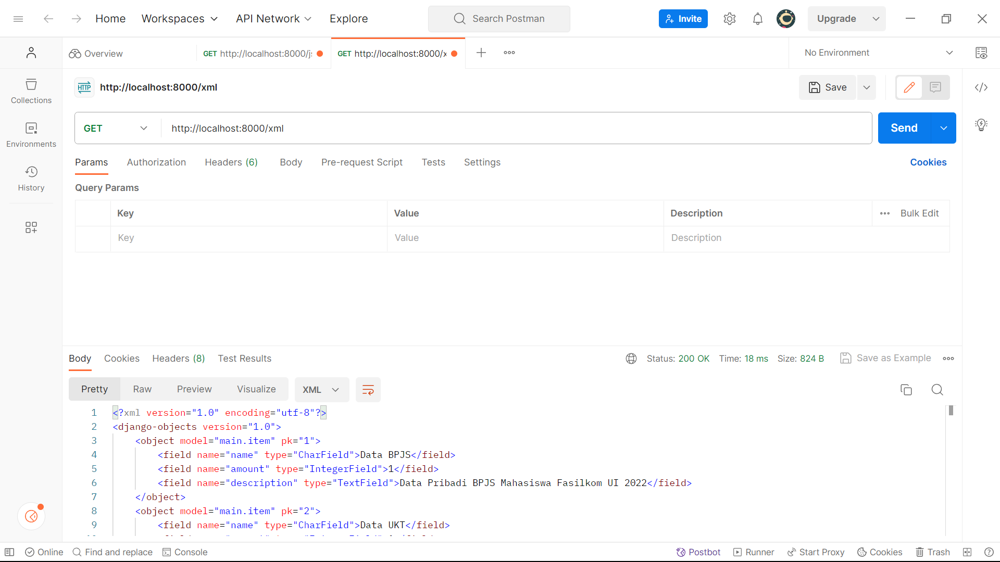

Fathi Qushoyyi Ahimsa (NPM 2206082120) 
PBP C
README.md (Tugas 2 dan Tugas 3)
Tautan Deployment Adaptable	: test

# Tugas 6
1. Perbedaan antara asynchronous programming dan synchronous programming terletak pada cara eksekusi program dilakukan. Synchronous programming menjalankan program secara berurutan, sementara asynchronous programming memungkinkan eksekusi program secara bersamaan. Asynchronous programming berguna ketika ada bottleneck pada jaringan atau disk, karena memungkinkan program untuk menjalankan tugas lain tanpa harus menunggu data yang diinginkan tersedia.

2. Paradigma event-driven programming adalah konsep di mana tindakan (event) tertentu memicu respons atau tindakan lain dalam program. Sebagai contoh, saat tombol ditekan, event-driven programming memungkinkan pemanggilan fungsi tertentu untuk merespons tindakan tersebut.

3. Dalam penerapan asynchronous programming pada AJAX, kita dapat menggunakan Fetch API. Contohnya adalah dengan menggunakan fungsi fetch(), yang melakukan permintaan HTTP, dan kemudian menggunakan .then() untuk menangani data yang diterima setelah permintaan selesai.

4. Dalam perbandingan antara Fetch API dan jQuery, Fetch API dianggap lebih baik karena lebih kuat, fleksibel, dan cepat. Selain itu, Fetch API merupakan antarmuka modern tanpa perlu mengimpor library tambahan seperti jQuery. Meskipun demikian, Fetch API memerlukan beberapa konfigurasi tambahan, seperti pengelolaan cookie. Dalam pandangan saya, fetch() lebih unggul dibandingkan jQuery.

5.  Butlah fungsi get_item_json untuk mengambil item berdasarkan pengguna yang sudah login. Lalu, tambahkan fungsi asinkron getItem di dalam blok <sript> pada file main.html menggunakan Fetch API untuk mengambil data JSON dari endpoint get_item_json di views.py.

Untuk AJAX POST, buatlah tombol yang membuka modal dengan formulir untuk menambahkan item baru. Sertakan fungsi view baru bernama add_item_ajax di views.py untuk menangani penambahan item baru dengan aman. Arahkan fungsi ini ke /create-ajax/ di urls.py. Pastikan formulir pada modal terhubung ke rute ini. Ketika pengguna menekan "Tambah Item", buatlah fungsi addItem yang menggunakan metode POST untuk mengambil data dari fungsi add_item di views.py. Setelah mendapatkan data, gunakan fungsi refreshItem untuk memperbarui daftar item pada kartu tanpa harus me-reload halaman utuh.

Terakhir, pastikan untuk menjalankan perintah python manage.py collectstatic di direktori utama proyek untuk mengumpulkan semua file statis dari berbagai aplikasi ke dalam satu folder, mempermudah penyajian di lingkungan produksi.

# Tugas 5
## Langkah 0: Setting Bootstrap CSS JS
Menambahkan kode Boostrap CSS dan JS, serta setting base.html agar menyesuaikan perilaku perangkat
```html
<head>
    
        <meta charset="UTF-8" />
        <meta name="viewport" content="width=device-width, initial-scale=1">
    

    <link href="https://cdn.jsdelivr.net/npm/bootstrap@5.3.2/dist/css/bootstrap.min.css" rel="stylesheet" integrity="sha384-T3c6CoIi6uLrA9TneNEoa7RxnatzjcDSCmG1MXxSR1GAsXEV/Dwwykc2MPK8M2HN" crossorigin="anonymous">
    <script src="https://code.jquery.com/jquery-3.6.0.min.js" integrity="sha384-KyZXEAg3QhqLMpG8r+J4jsl5c9zdLKaUk5Ae5f5b1bw6AUn5f5v8FZJoMxm6f5cH1" crossorigin="anonymous"></script>
</head>
```

## Menambahkan navbar
```html
    <nav class="navbar navbar-expand-lg navbar-light bg-light">
        <div class="container">
            <a class="navbar-brand" href="#" style="font-family: 'Mandali', sans-serif; color: green; font-weight: bold;">Data Leaked Store</a>
            <button class="navbar-toggler" type="button" data-toggle="collapse" data-target="#navbarNav" aria-controls="navbarNav" aria-expanded="false" aria-label="Toggle navigation">
                <span class="navbar-toggler-icon"></span>
            </button>
            <div class="collapse navbar-collapse justify-content-end" id="navbarNav">
                <ul class="navbar-nav">
                    <li class="nav-item">
                        <a class="nav-link" href="">Logout</a>
                    </li>
                </ul>
            </div>
        </div>
    </nav>
```

## Menambahkan fitur edit dan menambahkan berkas html
Saya menambahkan fungsi edit_item pada views.py
```python
def edit_product(request, id):
    # Get product berdasarkan ID
    product = Product.objects.get(pk = id)

    # Set product sebagai instance dari form
    form = ProductForm(request.POST or None, instance=product)

    if form.is_valid() and request.method == "POST":
        # Simpan form dan kembali ke halaman awal
        form.save()
        return HttpResponseRedirect(reverse('main:show_main'))

    context = {'form': form}
    return render(request, "edit_product.html", context)
```
Setelah itu saya membuat berkas edit_item.html agar mengarahkan ke halaman edit_item

## Mempercantik Tampilan

## Langkah 1: Tampilan Halaman Login
File: login.html
    Formulir login diposisikan di tengah halaman secara horizontal dan vertikal.
    Input field untuk username dan password memiliki border-radius dan padding untuk tampilan yang lebih baik.
    Tombol login memiliki latar belakang warna hijau dan berubah warna saat di-hover.
    Pesan validasi ditambahkan untuk memberi tahu pengguna tentang kesalahan input.

## Langkah 2: Tampilan Halaman Register   
File: register.html
- Tampilan halaman registrasi juga telah dimodifikasi mirip dengan halaman login.
- Formulir registrasi diposisikan di tengah halaman secara horizontal dan vertikal.
Input field untuk username, email, dan password memiliki border-radius dan padding untuk tampilan yang lebih baik.
Tombol register memiliki latar belakang warna hijau dan berubah warna saat di-hover.
Pesan validasi ditambahkan untuk memberi tahu pengguna tentang kesalahan input.

## Langkah 3: Tampilan Halaman Add New Item
File: add_item.html

Halaman "Add New Item" memiliki struktur yang mirip dengan halaman login dan registrasi.
Input field untuk nama, jumlah (amount), dan deskripsi dipisahkan ke dalam kolom terpisah menggunakan grid system Bootstrap.
Input field memiliki pesan validasi yang ditampilkan jika input tidak valid.
Tombol "Add Item" memiliki latar belakang warna hijau dan berubah warna saat di-hover.

## Langkah 4: Tampilan Halaman Edit Item
File: edit_item.html

Halaman "Edit Item" memiliki tata letak yang serupa dengan halaman "Add New Item".
Input field untuk nama, jumlah (amount), dan deskripsi dipisahkan ke dalam kolom terpisah menggunakan grid system Bootstrap.
Input field memiliki pesan validasi yang ditampilkan jika input tidak valid.
Tombol "Edit Item" memiliki latar belakang warna biru dan berubah warna saat di-hover.

## Pertanyaan Tugas 5
1. Selector pada CSS digunakan untuk menerapkan gaya (styling) ke elemen HTML. Beberapa jenis selector yang umum digunakan meliputi:
    
    ID Selector: Menggunakan atribut "id" untuk memilih elemen HTML tertentu.
    ```css
    p {
    color: red;
    }
    ```
    Artinya, semua elemen <p> akan memiliki warna teks merah
    
    Element Selector: Menggunakan nama elemen untuk memilih elemen HTML tertentu.
    ```css
    #header {
    background-color: blue;
    }
    ```
    Artinya, elemen dengan atribut id="header" akan memiliki latar belakang merah
    
    Class Selector: Menggunakan atribut "class" untuk memilih elemen HTML tertentu.
    ```css
    .btn-primary {
    background-color: red;
    }
    ```
    Artinya, elemen dengan atribut class="btn-primary" akan memiliki latar belakang merah.

2. Jelaskan HTML5 Tag yang kamu ketahui
```
    <a>: Membuat tautan (link) ke halaman web lain atau ke berkas lainnya.

    <canvas>: Memungkinkan gambar dan grafis interaktif dihasilkan dengan menggunakan JavaScript.

    <section>: Menandai bagian logis atau kelompok konten di dalam halaman web.

    <video>: Menyematkan video ke halaman web, memungkinkan pengguna untuk menonton video langsung di browser.

    <nav>: Menandai bagian dari halaman web yang berisi tautan navigasi, seperti menu.
```

3. Jelaskan perbedaan antara margin dan padding.
    Margin adalah ruang di luar batas elemen HTML. Fungsinya adalah mengontrol jarak antara elemen dengan elemen lain di sekitarnya atau elemen dengan batas area induknya. Pengaturan nilai margin dapat dilakukan dalam piksel, persen, atau proporsi lainnya. Pengaruh margin adalah pada tata letak keseluruhan halaman, karena menentukan seberapa jauh elemen tersebut dari elemen lainnya. Sebagai contoh, dengan mengatur margin, elemen dapat dipindahkan ke posisi tertentu di halaman web, menjauh atau mendekat dari elemen-elemen lainnya.

    Padding, di sisi lain, adalah ruang di dalam batas elemen HTML, di antara batas elemen dan kontennya sendiri. Fungsinya adalah mengontrol jarak antara konten elemen dan batasnya. Pengaturan nilai padding juga bisa dilakukan dalam piksel, persen, atau proporsi lainnya. Padding hanya mempengaruhi ruang di dalam elemen itu sendiri, tidak mempengaruhi elemen lain di sekitarnya. Sebagai contoh, padding digunakan untuk menjaga konten elemen tetap berjarak dari batas elemennya, menciptakan ruang di sekitar konten tersebut.

4. Jelaskan perbedaan antara framework CSS Tailwind dan Bootstrap. Kapan sebaiknya kita menggunakan Bootstrap daripada Tailwind, dan sebaliknya?
Bootstrap:
- Menyediakan komponen UI dan gaya pra-dibuat untuk membangun situs web - dengan cepat.
- Mengandalkan kelas CSS yang telah ditentukan sebelumnya, memungkinkan pembangunan cepat dan konsistensi antarmuka.
- Cocok untuk proyek-proyek dengan tata letak standar yang memerlukan pembangunan cepat.

Tailwind CSS:
- Menggunakan pendekatan "utility-first", menyediakan kelas-kelas CSS kecil yang dapat digunakan langsung di HTML.
- Memberikan fleksibilitas tinggi dan memungkinkan pembangunan antarmuka yang sangat kustom.
- Cocok untuk proyek-proyek yang memerlukan desain yang sangat variatif atau memerlukan penyesuaian tingkat tinggi, meskipun memerlukan pemahaman CSS yang lebih dalam.

Kapan Menggunakan:

Bootstrap: Cocok untuk proyek-proyek dengan tata letak standar yang memerlukan pembangunan cepat dan konsistensi antarmuka.
Tailwind CSS: Ideal untuk proyek-proyek dengan desain yang variatif atau memerlukan penyesuaian tingkat tinggi, dan bagi pengembang yang ingin kendali yang lebih besar atas desainnya.


#Tugas 4
## 1. Membuat Form Registrasi
Pertama-tama kita dapat membuat form registrasi dengan membuat fungsi register seperti kode berikut. Fungsi register ini dapat dibuat pada folder `views.py` pada subdirektori main
```python
def register(request):
    form = UserCreationForm()

    if request.method == "POST":
        form = UserCreationForm(request.POST)
        if form.is_valid():
            form.save()
            messages.success(request, 'Your account has been successfully created!')
            return redirect('main:login')
    context = {'form':form}
    return render(request, 'register.html', context)
```
Kode di atas berfungsi untuk membuat formulir registrasi dan menyimpan data pengguna ketika pengguna menekan tombol register

## 2. Membuat Fungsi Login dan Logout
Selanjutnya, kita dapat membuat fungsi login dan logout dengan menambahkan kode berikut pada `views.py` di subdirektori main

```python
def login_user(request):
    if request.method == 'POST':
        username = request.POST.get('username')
        password = request.POST.get('password')
        user = authenticate(request, username=username, password=password)
        if user is not None:
            login(request, user)
            return redirect('main:show_main')
        else:
            messages.info(request, 'Sorry, incorrect username or password. Please try again.')
    context = {}
    return render(request, 'login.html', context)

def logout_user(request):
    logout(request)
    return redirect('main:login')
```

## 3. Routing fungsi ke urlpatterns pada urls.py
Setelah membuat fungsi-fungsi di atas, kita dapat melakukan routing ke urlpattern pada urls.py sehingga kita dapat mengakses fungsi yang sudah kita buat sebelumnya
```python
...
path('register/', register, name='register'),
path('login/', login_user, name='login'),
path('logout/', logout_user, name='logout'),
...
```

## 4. Membuat berkas HTML untuk Register, Login, dan Logout
Untuk  fungsi register, kita dapat membuat berkas HTML dengan nama `register.html` pada `folder main/template` dengan kode sebagai berikut
```html



    <title>Register</title>


  

<div class = "login">
    
    <h1>Register</h1>  

        <form method="POST" >  
              
            <table>  
                {{ form.as_table }}  
                <tr>  
                    <td></td>
                    <td><input type="submit" name="submit" value="Daftar"/></td>  
                </tr>  
            </table>  
        </form>

      
        <ul>   
              
                <li>{{ message }}</li>  
                  
        </ul>   
    

</div>  


```

Setelah itu, kita juga dapat membuat berkas login.html pada subdirektori yang sama. Hal ini berfungsi untuk menampilkan fungsi login ke dalam website. Kita dapat melakukan hal tersebut dengan menambahkan kode berikut:
```html



    <title>Login</title>




<div class = "login">

    <h1>Login</h1>

    <form method="POST" action="">
        
        <table>
            <tr>
                <td>Username: </td>
                <td><input type="text" name="username" placeholder="Username" class="form-control"></td>
            </tr>
                    
            <tr>
                <td>Password: </td>
                <td><input type="password" name="password" placeholder="Password" class="form-control"></td>
            </tr>

            <tr>
                <td></td>
                <td><input class="btn login_btn" type="submit" value="Login"></td>
            </tr>
        </table>
    </form>

    
        <ul>
            
                <li>{{ message }}</li>
            
        </ul>
         
        
    Don't have an account yet? <a href="">Register Now</a>

</div>


```

Selain itu, untuk dapat memunculkan fungsi logout, kita menambahkan kode html pada berkas main.html. Berikut ini kode yang dapat kita gunaakan untuk menambahkan berkas html logout
```html
...
<a href="">
    <button>
        Logout
    </button>
</a>
...
```

## 4. Restriksi halaman main
Agar website kita hanya dapat diakses oleh pengguna yang mempunyai akun, kita dapat membatasi akses hanya kepada pengguna yang sudah login. Kita dapat membatasi aksesnya dengan menambahkan pembatas login pada fungsi `show main` seperti berikut ini:
```python
...
@login_required(login_url='/login')
def show_main(request):
...
```

## 5. Menggunakan cookies untuk menampilkan last login
Kita dapat menambahkan cookie last login dengan cara mengganti kode blok `if user is not None` pada fungsi login user. Blok kode ini akan memanggil fungsi login agar user perlu memasukkan akunnya, lalu membuat respose redirect menuju fungsi `show_main`, dan menambahkan cookie waktu pada `last_login` agar tersimpan kapan pengguna terakhir kali mengakses akun tersebut. Kita dapat melakukannya dengan mengganti blok seperti berikut ini:

```python
...
if user is not None:
    login(request, user)
    response = HttpResponseRedirect(reverse("main:show_main")) 
    response.set_cookie('last_login', str(datetime.datetime.now()))
    return response
...
```
Selain itu, kita juga perlu menambahkan potongan kode pada variabel context di fungsi `show_main`

```python
context = {
    'name': 'Pak Bepe',
    'class': 'PBP A',
    'products': products,
    'last_login': request.COOKIES['last_login'],
}
```
Kita juga perlu mengubah fungsi `logout_user` untuk menghapus cookie `last_login` saat pengguna melakukan logout

```python
def logout_user(request):
    logout(request)
    response = HttpResponseRedirect(reverse('main:login'))
    response.delete_cookie('last_login')
    return response
```

## 6. Menghubungkan Items dengan User
Untuk menghubungkan items dengan user, kita dapat menambahkan potongan kode pada model Items di models.py
```python
class Item(models.Model):
    user = models.ForeignKey(User, on_delete=models.CASCADE)
    ...
```
Kode di atas berfungsi untuk menghubungkan satu produk terhadap satu user

Selanjutnya, kita juga perlu mengubah fungsi `create_item` menjadi seperti ini:
```python
def create_product(request):
 form = ProductForm(request.POST or None)

 if form.is_valid() and request.method == "POST":
     product = form.save(commit=False)
     product.user = request.user
     product.save()
     return HttpResponseRedirect(reverse('main:show_main'))
 ...
```
Kita juga perlu mengubah fungsi `show_main` agar item yang ditampilkan sesuai dengan akun pengguna yang telah login. Kita dapat melakukannya sebagai berikut ini:
```python
def show_main(request):
    products = Product.objects.filter(user=request.user)

    context = {
        'name': request.user.username,
    ...
...
```
Disebabkan kita mengubah models.py, kita perlu melakukan migration dengan perintah
```python
py manage.py makemigrations
py manage.py migrate
```
Apabila terjadi error, kita dapat menambahkan value `1` ketika diminta memasukkan input terhadap default value dari field user

Selesai! 

# Pertanyaan Tugas 3
## Apa itu Django UserCreationForm dan jelaskan apa kelebihan dan kekurangannya?
`User CreationForm` merupakan sebuah `form` dalam Django yang menggunakan konsep model. `UserCreationForm` mempunyai kemiripan dengan `ModelForm` dalam penggunaannya. Kelebihannya, `UserCreationForm` mempunyai kemudahakan dan kecepatan dalam membuat form. Selain itu, kita tidak perlu membuat model dan bisa langsung menyimpannya ke dalam database. Kelemahannya terletak pada kesulitannya untuk melakukan customisasi. Tetapi, kita masih dapat melakukan customisasi dengan mengubah komponennya secara satu per-satu

## Apa perbedaan authentikasi dan authorisasi dalam konteks DJango, dan mengapa keduanya sangat penting?
Authentikasi (Authentication) dan Authorisasi (Authorization) adalah dua konsep kunci dalam pengembangan aplikasi web, termasuk dalam framework Django. Authentikasi adalah proses verifikasi identitas pengguna dengan menguji kredensial untuk mencegah akses ilegal ke dalam sistem.Sementara authorisasi mengatur apa yang pengguna dapat lakukan setelah terautentikasi yang berkaitan dengan hak akses/peran yang diberikan kepada pengguna. Hal ini bertujuan untuk mencegah pengguna mengakses/merubah sesuatu yang tidak seharusnya diubah. Keduanya saling melengkapi untuk menjaga keamanan dan integritas sistem. Oleh karena itu, penting untuk membuat sistem keamanan terpadu dan berlapis dengan memanfaatkan kedua hal tersebut. 

## Apa itu cookies dalam konteks aplikasi web, dan bagaimana Django menggunakan cookies untuk mengelola data sesi pengguna?
Cookies adalah penyimpanan sementara yang digunakan untuk melacak perubahan, penggunaan, dan akses terhadap sebuah website. Cookies didapatkan dari request server kepada browser untuk menyimpan data, lalu browser akan menyimpan cookie dengan bentuk dictionary/hashmap. Selain itu, disimpan juga domain, path, tanggal expired, ukuran, dan berbagai data lainnya selain data cookies itu sendiri

## Apakah penggunaan cookies aman secara default dalam pengembangan web, atau apakah ada risiko potensial yang harus diwaspadai?
Keamanan cookies bergantung terhadap penggunaan oleh client. Hal ini dikarenakan cookies transparan dan dapat dilihat oleh client sehingga tidak disarankan untuk menyimpan data sensitif. Selain itu, cookie juga dapat ditiru dengan mudah sehingga dapat digunakan untuk mengakses website/server. Peniruan cookie tersebut biasa disebut sebagai cookie stealing, yaitu cookie yang ditinggalkan tanpa batas waktu yang jelas dapat membuka potensi risiko jika cookie tersebut dapat diambil alih oleh pihak yang tidak berwenang di masa depan.


# TUGAS 3
•	Apa perbedaan antara form post dan form get pada Django?
Perbedaan antara kedua form tersebut terletak pada beberapa hal, antara lain metode HTTP yang digunakan, keamanan, pembaruan data, dan juga kapasitas data. Ketika kita menggunakan form POST, data di dalam form dikirimkan dalam bentuk HTTP yang tidak terlihat dalam url. Hal ini berguna Ketika kita mengirim data sensitive. Akan tetapi, ketika kita menggunakan form GET, data form disertakan dalam parameter query string. Hal tersebut menyebabkan keamanan form POST jauh lebih aman dibandingkan dengan form GET karena visibilitas dari bentuk HTTP yang tidak terlihat dalam url tadi. Selain itu, kapasitas pengiriman data untuk form POST juga jauh lebih besar daripada form GET yang dikirim melalui url. Dengan menggunakan form POST, kita juga bisa memperbarui atau menyimpan informasi di server, sedangkan form GET hanya bisa melakukan request pembacaan data tanpa bisa memodifikasi data yang ada.

#Another put, patch and delete. Mengubah data yang udah ada -> Put or Patch, keduanya buat update. Perbedaannya kalo put mengubah semua atribut. Kalau patch hanya beberapa atribut yang diubah. Delete buat hapus data. 

•	Perbedaan utama antara XML, JSON, dan HTML dalam konteks pengiriman data
1.	XML (eXtensible Markup Language): biasa digunakan untuk menggambarkan struktur data dengan nama variable/tag yang sudah diatur sebelumnya. XML dapat digunakan untuk pertukaran data dan pemodelan data. Akan tetapi, kompleksitas XML sendiri jauh lebih kompleks dibandingkan dengan JSON dan HTML.
2.	JSON (Javascript Object Notation): JSON mempunyai format yang mudah dibaca oleh manusia dan sering digunakan dalam pertukaran data, khususnya pada website. JSON yang mempunyai format sederhana ini mendukung tipe data primitive dan sederhana, seperti string, Boolean, integer, dll. 
3.	HTML (HyperText Markup Language): HTML biasa digunakan sebagai template tampilan dan struktur halaman website. Dalam HTML, biasa digunakan tag markup yang dipakai untuk mendefinisikan elemen-elemen visual, seperti head, body, dan paragraph. HTML tidak digunakan untuk pertukaran data karena fungsi HTML lebih spesifik dengan tampilan dan interaksi dengan pengguna

•	Mengapa JSON sering digunakan dalam pertukaran data antara aplikasi web modern?
Terdapat beberapa alasan JSON sering digunakan untuk pertukaran data antar web app. Pertama, JSON mempunyai visibilitas yang mudah dibaca oleh manusia sehingga mudah untuk mengatur, memahami, dan membuat struktur data yang terstruktur dengan baik untuk dikirimkan antar aplikasi. Kedua, JSON mempynyai kompatibilitas dengan Javascript yang memudahkan penggabungan implementasi kode aplikasi web yang dibangun dengan Javasccript. Ketiga, JSON dapat diproses oleh berbagai Bahasa pemrograman yang membuat berbagai programmer dapat mengakses dan menggunakan JSON secara luas. 

•	Jelaskan bagaimana cara kamu mengimplementasikan checklist di atas secara step-by-step
1.	Pertama-tama, kita perlu melakukan routing dari main ke/ agar sesuai dengan konvensi routing yang ada
2.	Selanjutnya kita perlu mengimplementasikan skeletaon dengan membuat berkas base.html pada root folder templates (perlu membuat folder baru). Base.html berfungsi untuk kerangka umum website. Selanjutnya, kita perlu menyesuaikan kode setting.py agar dapat membaca berkas base.html dengan menambahkan base pada kode TEMPLATES. Selain itu, kita perlu mengubah berkas main.html pada direktori main agar sesuai dengan template dari base yang telah kita buat tadi.
3.	Selanjutnya, kita perlu membuat form input. Form input dapat dibuat dengan membuat berkas forms.py pada direktori main. Kita perlu membuat function Bernama create_item untuk menghasilkan form yang dapat menambahkan data produk secara otomatis Ketika user menekan tombol submit (tombol submit kita representasikan dengan nama Add Item). Selain itu, kita perlu mengubah berkas views.py agar dapat membaca form item yang telah dibuat. Kita juga perlu melakukan routing ke dalam urlpatterns agar dapat mengakses function yang ada pada forms.py. 
4.	Setelah forms dan routing diatur, kita perlu menambahkan template dengan nama create_item.html untuk menampilkan fields form. Kita juga pelru untuk menambahkan kode  pada berkas main.html
5.	Kita perlu membuat pengembalian data dalam bentuk XML dan JSON. Hal ini dapat dilakukan dengan membuat function dalam berkas views.py pada folder main agar variable di dalam function tersebut dapat menyimpan query data item dan dapat mereturn hasil query yang sudah ditransformasi menajdi JSON  dan XML. Selanjutnya kita dapat melakukan routing path url ke dalam urlpatterns untuk mengakses kedua fungsi XML dan JSON tersebut. 
6.	Selanjutnya, kita perlu membuat pengembalian data ID dalam XML dan JSON. Kita dapat membuat fungsi pada views.py di folder main dengan nama show_xml_by_id dan show_json_by_id. Buatlah sedikit mirip dengan proses yang telah kita lakukan pada nomor sebelumnya. Tambahkan juga part hurl ke urlpatterns dengan format sebagai berikut
path('xml/<int:id>/', show_xml_by_id, name='show_xml_by_id'),
path('json/<int:id>/', show_json_by_id, name='show_json_by_id'), 
7.	Website yang telah dibuat sudah dapat dijalankan dan dapat dicek dengan menggunakan Postman sebagai data viewer

Screenshot Gambar Postman
HTML


JSON


XML


JSON by ID


XML by ID

<<<<<<< HEAD


# TUGAS 2
•	Jelaskan bagaimana cara kamu mengimplementasikan checklist di atas secara step-by-step (bukan hanya sekadar mengikuti tutorial).
1.	Pertama-tama saya membuat sebuah folder bernama tugas2 pada direktori lokal di dalam laptop. Lalu dengan mengaktifkan virtual environment, saya melakukan instalasi Django dengan menambahkan berkas requirements.txt ke dalam direktori tugas2.
2.	Setelah itu, saya melakukan konfigurasi proyek dengan menambahkan nilai “*” pada variable ALLOWED_HOST agar semua orang dapat mengakses aplikasi
3.	Menjalankan perintah “django-admin startproject data_leaked_store” dan terbantuk folder tugas_inventory sebagai app dari proyek tugas2.
4.	Membuat aplikasi baru dengan perintah “python manage.py startapp main” dan mendaftarkan main ke dalam daftar aplikasi yang ada di dalam proyek
5.	Selanjutnya, saya merubah berkas model dengan menambahkan beberapa variable seperti name, amount, price, dan description. Lalu saya melakukan migrasi model
6.	Setelah itu, saya membuat fungsi untuk mengatur tampilan di dalam aplikasi main. Tampilan ini akan digunakan untukk membuat tampilan html 
7.	Membuat folder templates dalam direktori utama dan menambahkna file main.html yang akan berfungsi sebagai template tampilan website. File yang dibuat langsung memuat kode Django yang akan digunakan untuk menampilkan data, seperti name, class, dan npm
8.	Saya menambahkan file urls.py dalam direktori main yang berfungsi untuk me-return aplikasi main ke dalam peramban web ketika diakses 
9.	Selanjutnya, saya menambahkan rute url di dalam direktori proyek agar url aplikasi main dapat diakses di tingkat proyek
10. Mengubah konfigurasi pada unit test
11.	Membuat berkas gitignore dan inisiasi repository di dalam github 
12.	Melakukan push ke repository melalui command prompt
13. Melakukan deploy ke adaptable

•	Buatlah bagan yang berisi request client ke web aplikasi berbasis Django beserta responnya dan jelaskan pada bagan tersebut kaitan antara urls.py, views.py, models.py, dan berkas html.


•	Jelaskan mengapa kita menggunakan virtual environment? Apakah kita tetap dapat membuat aplikasi web berbasis Django tanpa menggunakan virtual environment?
Dengan menggunakan virtual environment, kita ddapat menginstall package-package yang dibutuhkan dalam sebuah proyek tanpa mengganggu keseluruhan device yang sedang dipakai. Hal ini memudahkan apabila kita membuat berbagai proyek dengan versi package yang berbeda-beda
Kita tetap bisa membuat aplikasi web berbasis Django tanpa menggunakan virtual environment. Akan tetapi, besar kemungkinan terjadi error karena setiap proyek diinstal dengan package yang berbeda-beda. Hal ini akan membuat versi package akan terus diperbarui sedangkan proyek yang telah dibuat menggunakan versi lama. Perbedaan ini membuat inkompatibilitas package ssehingga proyek tidak bisa dijalankan.

•	Jelaskan apakah itu MVC, MVT, MVVM dan perbedaan dari ketiganya.
1.	MVC merupakan singkatan dari Model, View, Controller. Model merupakan komponen yang menerima data dari database dan menyalurkannya ke controller. Controller merupakan komponen penghubung view dan model, berfungsi untuk mendapatkan respons pengguna dan melakukan perubahan model sesuai dengan request. View merupakan tampilan visualiasi yang terlihat pada user. 
2.	MVT merupakan singkatan dari Model, View, dan Template. Sama dengan MVC, model dalam MVT berguna untuk berkomunikasi dengan database. Template berguna untuk mengelola tampilan aplikasi. View berguna untuk menyimpan action yang dilakukan oleh user dan memberikan/menyajikan tampilan aplikasi
3.	MVVM merupakan singkatan dari Model, View, dan ViewModel. ViewModel berguna untuk mengakomodasi pemrosesan yang dilakukan dari model ke view. View sendiri merupakan tampilan aplikasi dan berguna sebagai penyimpan input/action dari user. 
4.	Perbedaan dari Ketiganya terletak pada pengikatan data. MVC mempunyai mekanisme akses data yang saling terikat satu sama lain. Sedangkan model lain menggunakan komponen lain dalam saluran komunikasi dantara model dan view. MVT dan MVVM mempunyai referensi terhadap templates dan ViewModel. Sedangkan MVC tidak punya referensi/control terhadap controller. Pada MVT, view berperan untuk membuat template yang sesuai dengan permintaan. Sedangkan template pada MVT mempunyai fungsi yang mirip dengan view di dalam MVC. Selain itu, perbedaan ketiga bentuk desain system ini terletak pada kemudahan implementasi perubahan pada kode. MVT dan MVVM lebih mudah dalam melakukan perubahan dan mudah apabila kita ingin menaikkan skalabilitas. Selain itu, kerumitan juga  menjadi perbedaan, MVC mempunyai flow yang paling mudah dipahami. 

=======
>>>>>>> 04d533b5fe211a1aea888cb55566ab6c5a852b84
